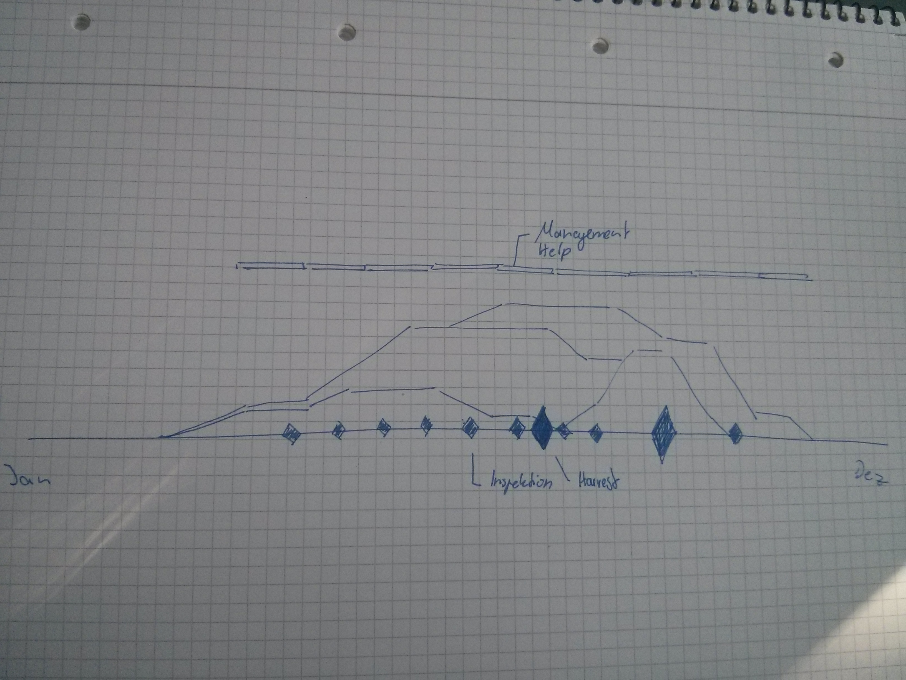

Mission Statement
__________________

:css: rtd.css

This is a test presentation with Hovercraft.

invoke docs_presentation

----

equilibeeum
===================

----

Spannende Fragen die wir beantworten wollen
===================

* Wo leben gesunde Bienen
* Wie leben diese Bienen
* Wo produzieren Bienen viel Honig
* Wo ist noch Platz für Bienen
* Wo gibt es Krankheiten

----

Idee
=====================

 * Was ist im Honig drin
 * Leitfaden für Stadtimker
 * Hive management / Inspektionen

----

Dinge die daraus entstehen
===========================

 * Hives die von Varoa sterben
 * Wo leben gesunde Hives
 * Hive Stammbaum
 * Wo ist noch Platz für Hives (Heatmap)
 * Wo kann was getan werden

----

Aggregation
=============================================

* Karteninformationen
* Landnutzung der Umgebung: Stadt, Land, Wasser
* Botatnische Informationen
* Wetter
* Imkerguidelines

----

Seasonoverview
================

* Inspektions
* Ernte
* Nectar / Pollen der Bäume am Apiary
* Pflegehilfe auf KW basis

----

Dinge die wir mit den Bäumen machen können
=============================================

* Nectarflow über die Saison
* Pollenflow über die Saison

